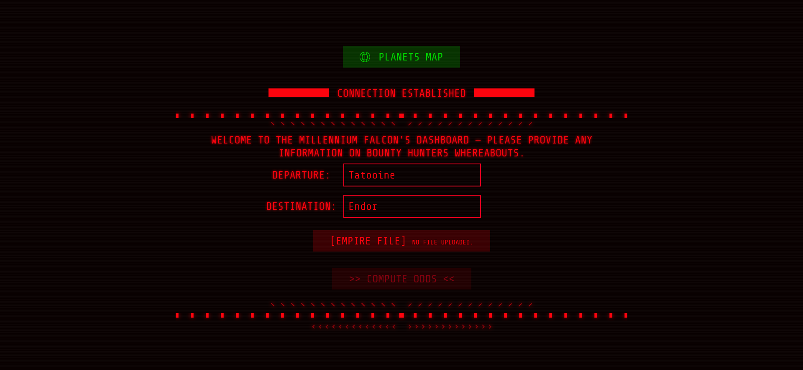

# :rocket: Millennium Falcon Challenge @ [Dataiku](https://www.dataiku.com/)

:book: [Project's Specification](https://github.com/dataiku/millenium-falcon-challenge)

**Before anything else, please add the following lines to your RUNCOM (`.bashrc`, `.zshrc`, etc. depending on your shell) file:**

```shell
export MFC_PATH=~/<path_to_this_folder>
source $MFC_PATH/cli/give-me-the-odds.sh
```

**You will then need to open a new shell for changes to take effect.**

---

## :floppy_disk: Database Creation & Population

The following command creates and populates the `universe.db` database based on `universe.sql`:

```bash
cat universe.sql | sqlite3 universe.db
```

_**Note:** this command doesn't need to be run if you do not modify `universe.sql`, since the database is already initialized in this repo._

The `ROUTES` table of `universe.db` contains the following data:

|  origin  | destination | travel_time |
| :------: | :---------: | :---------: |
| Tatooine |   Dagobah   |      6      |
| Dagobah  |    Endor    |      4      |
| Dagobah  |    Hoth     |      1      |
|   Hoth   |    Endor    |      1      |
| Tatooine |    Hoth     |      6      |

---

## :gear: Backend

**Navigate to `/backend`.**

### :bookmark_tabs: Dependencies

- [Python 3](https://www.python.org/downloads/)
- [Flask](https://flask.palletsprojects.com/en/1.1.x/)
- [Flask-RESTX](https://flask-restx.readthedocs.io/en/latest/index.html)
- [Flask-CORS](https://flask-cors.readthedocs.io/en/latest/)
- [pytest](https://docs.pytest.org/en/6.2.x/contents.html)
- [NetworkX](https://networkx.org/)

Install all the dependencies locally with:

```bash
pip3 install -r requirements.txt
```

### :gear: Launching the backend

Launch the backend with:

```bash
python3 app.py
```

And navigate to http://localhost:5000/ to explore the [Swagger](https://swagger.io/) documentation of the backend RESTful API.

### :white_check_mark: Unit testing

Run the following command to run [pytest](https://docs.pytest.org/en/6.2.x/contents.html)'s unit tests:

```bash
python3 -m pytest --no-header --no-summary -v
```

All tests should pass and print the following content to the console:

```bash
============================= test session starts ==============================
collected 4 items

backend/tests/gmto_test.py::TestComputeOdds::test_first_sample PASSED    [ 25%]
backend/tests/gmto_test.py::TestComputeOdds::test_fourth_sample PASSED   [ 50%]
backend/tests/gmto_test.py::TestComputeOdds::test_second_sample PASSED   [ 75%]
backend/tests/gmto_test.py::TestComputeOdds::test_third_sample PASSED    [100%]

============================== 4 passed in 0.04s ===============================
```

---

## :round_pushpin: Frontend

**Navigate to `/frontend`.**

:gear: _This frontend app was generated with [Angular CLI](https://github.com/angular/angular-cli) version 13.3.5._

:art: _UI inspiration from [rémi on CodePen](https://codepen.io/remsrob/pen/ZRyqNx)._

### :gear: Running the app

Install or update dependencies with:

```bash
npm install
```

Run `npm run start` for a dev server and navigate to http://localhost:4200/. The application will automatically reload if you change any of the source files.

Make sure the backend is running on http://localhost:5000/.

### :eyes: Application overview



When landing on the application you will be able to:

- visualize the data from `unvierse.db` - ie. the different routes and the corresponding travel time between each planet of the universe ;
- upload an `empire.json` file containing the data intercepted by the rebels about the plans of the Empire to compute the odds of the mission's success.

  The `empire.json` file should follow this format:

  ```json
  {
    "countdown": 6,
    "bounty_hunters": [
      { "planet": "Tatooine", "day": 4 },
      { "planet": "Dagobah", "day": 5 }
    ]
  }
  ```

  Some sample `empire.json` files are located in `sample-data/`.

---

## CLI

You can use the `give-me-the-odds` command:

`give-me-the-odds <millennium-falcon.json> <empire.json>` will return the probability of success of the mission as a number ranging from 0 to 100.

It takes 2 file paths as input - respectively the paths toward the `millennium-falcon.json` and `empire.json` files.
